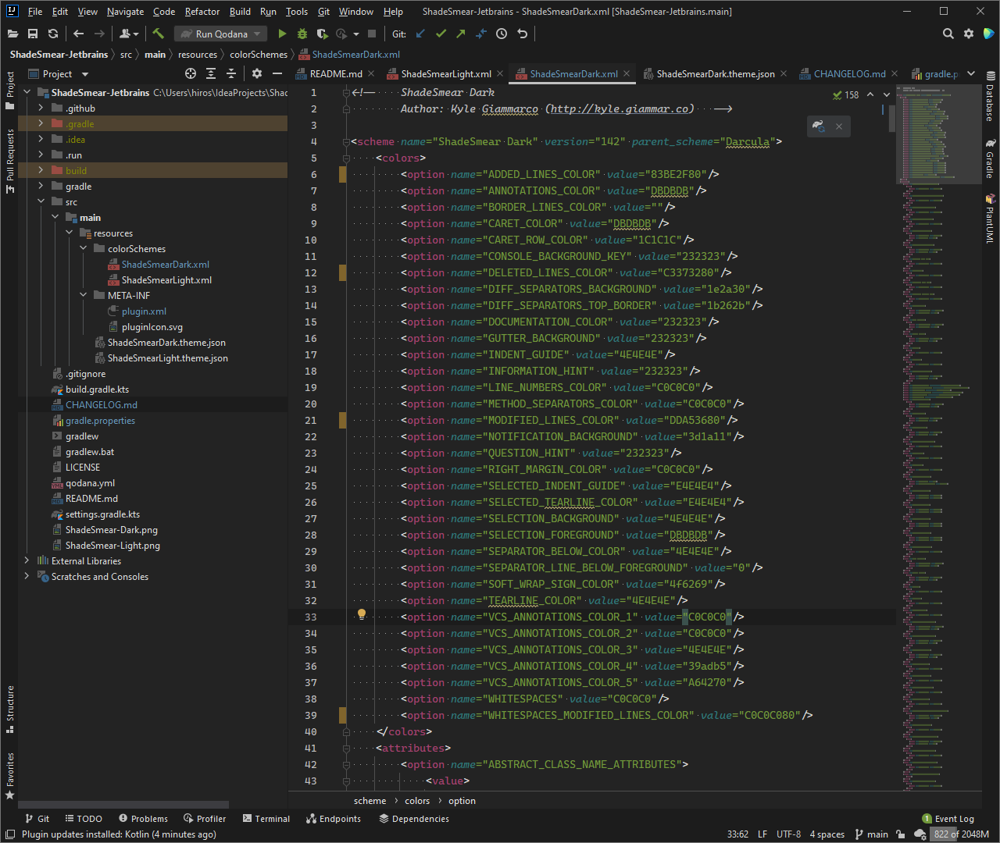
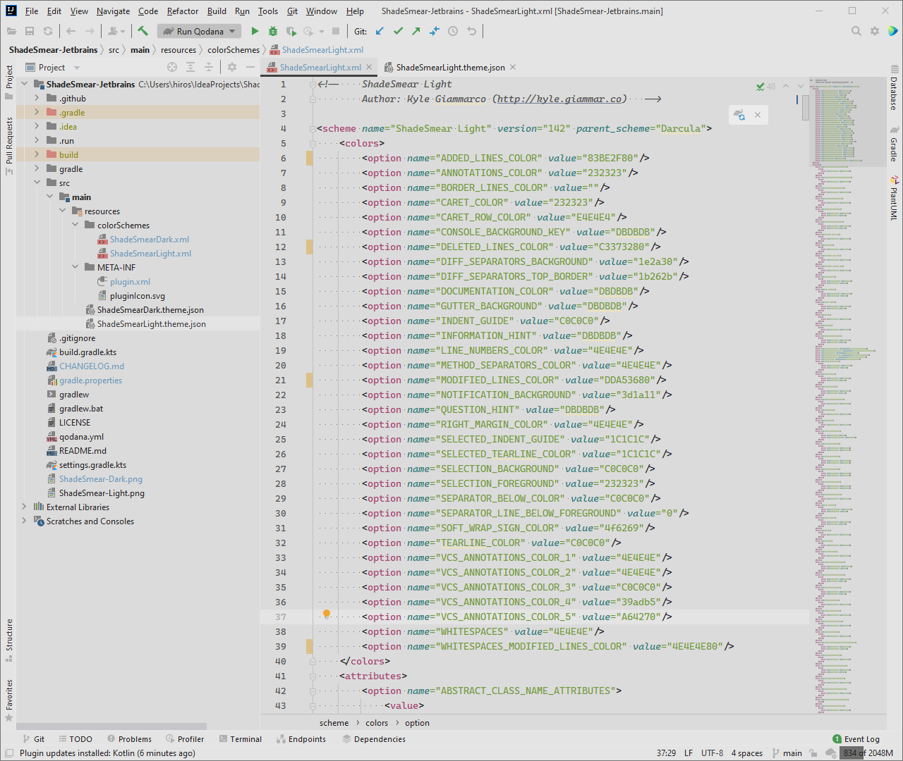

# Shadesmear-Jetbrains

<!-- Plugin description -->
A mellow color scheme for IntelliJ IDEs, with a dark and light variant 
<!-- Plugin description end -->

## ScreenShots

### Dark

### Light

## Installation

- Using IDE built-in plugin system:
  
  <kbd>Settings/Preferences</kbd> > <kbd>Plugins</kbd> > <kbd>Marketplace</kbd> > <kbd>Search for "Shadesmear-Jetbrains"</kbd> >
  <kbd>Install Plugin</kbd>
  
- Manually:

  Download the [latest release](https://github.com/HiRoS-neko/Shadesmear-Jetbrains/releases/latest) and install it manually using
  <kbd>Settings/Preferences</kbd> > <kbd>Plugins</kbd> > <kbd>⚙️</kbd> > <kbd>Install plugin from disk...</kbd>

---
Plugin based on the [IntelliJ Platform Plugin Template][template].

[template]: https://github.com/JetBrains/intellij-platform-plugin-template
